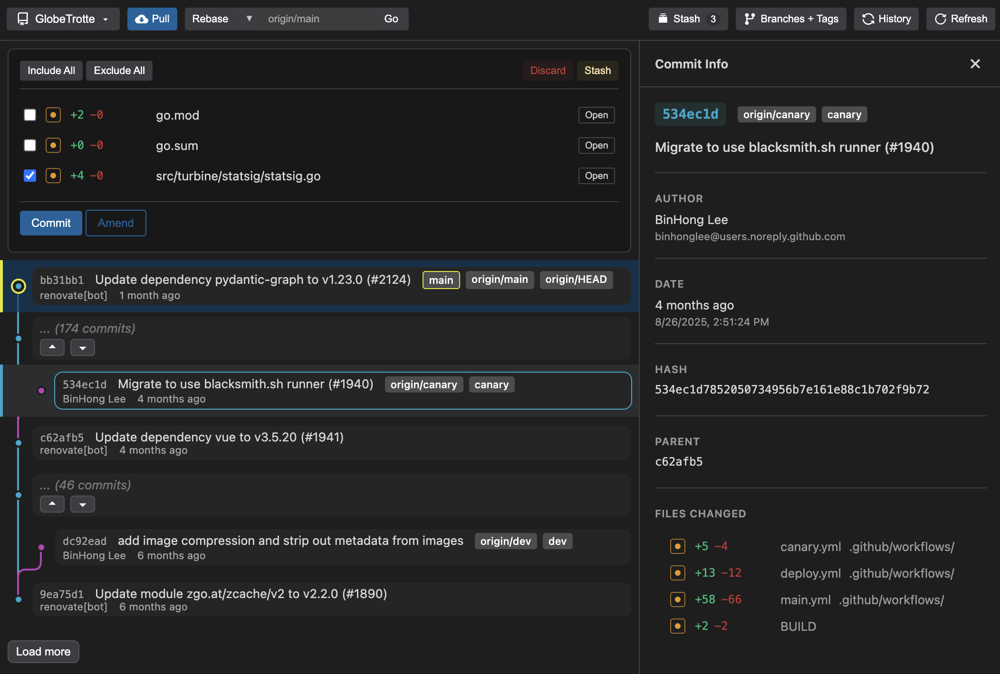
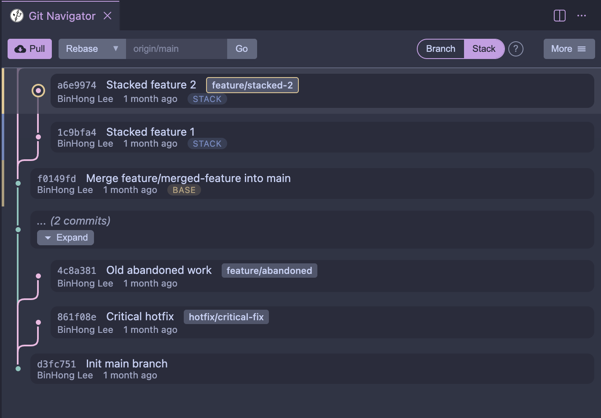
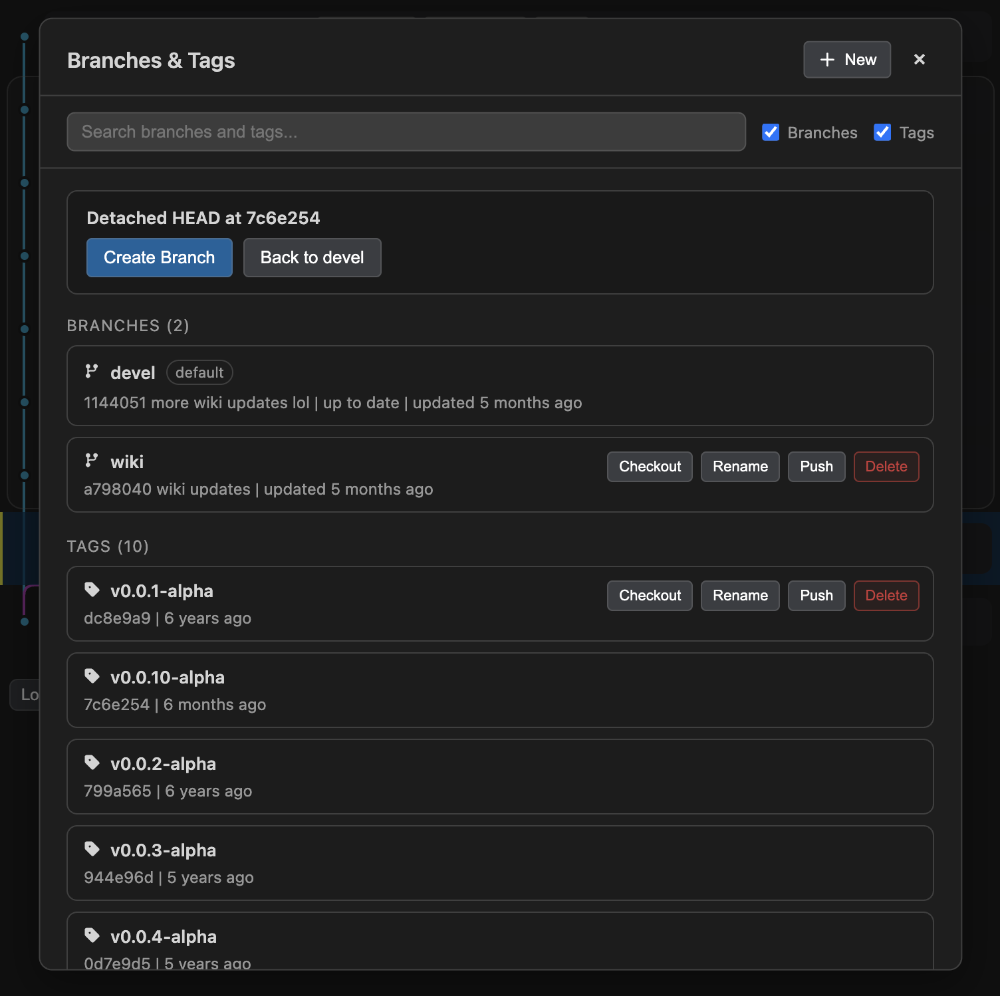

# Git Navigator

**Transform your Git workflow with an intuitive, visual interface that makes complex operations simple.**

Git Navigator brings the power of Git into a beautiful, interactive visualization directly in VS Code and compatible editors. Whether you're managing commits, resolving conflicts, or rebasing branches, everything is just a click or drag away. Git Navigator is also available as a standalone desktop app for the same core workflows outside the editor.

## ⬇️ Install

### Desktop app
- macOS (Apple Silicon): [Download](https://github.com/binhonglee/git_navigator/releases/latest/download/Git.Navigator_0.3.8_aarch64.dmg)
- Windows (x64): [Download](https://github.com/binhonglee/git_navigator/releases/latest/download/Git.Navigator_0.3.8_x64.msi)
- Linux (.deb, x64): [Download](https://github.com/binhonglee/git_navigator/releases/latest/download/Git.Navigator_0.3.8_amd64.deb)

### Editor extension
- VS Code Marketplace: [Install](https://marketplace.visualstudio.com/items?itemName=binhonglee.git-navigator)
- Open VSX: [Install](https://open-vsx.org/extension/binhonglee/git-navigator)

## ✨ Features

### 📊 Visual Commit Graph
<video src="static/commit-graph.mp4" controls muted autoplay loop></video>

See your entire project history at a glance with an interactive, tree-based commit visualization. The graph shows:
- Parent-child relationships between commits
- Branch and tag labels displayed inline
- Favorite branches that stay visible when starred
- Current commit highlighted on the graph with a ringed dot and tinted row
- Orphaned branches highlighted for easy cleanup

**One-click checkout** - Simply click any commit to check it out and explore your project's history.

### 🧭 Stack mode and Branch mode

Choose between traditional branch mode and stack mode for stacked PR workflows. Stack mode keeps descendant commits aligned when you amend or rebase; branch mode keeps operations scoped to the current branch.
Learn more in the [Stack vs Branch Mode guide](https://gitnav.xyz/stack.html).

### 🔄 Drag-and-Drop Rebase
<video src="static/rebase.mp4" controls muted autoplay loop></video>

Rebase commits visually without memorizing complex commands. Drag any commit onto another to preview and execute rebase operations instantly. Visual feedback shows you exactly what will happen before you commit.

### ✅ Intelligent Commit Management
<video src="static/uncommitted.mp4" controls muted autoplay loop></video>

Take control of your commits with granular precision:
- **Stage/unstage files** with one click
- **Line-level selection** - Include or exclude specific code blocks from your commits
- **Amend** - Update the last commit with additional changes
- **Update message** - Edit commit messages from the sidebar with rewrite support
- **Uncommit** - Remove the last commit completely

### 🤖 AI Assistance
<video src="static/ai-split-and-commit.mp4" controls muted autoplay loop></video>

Use your editor's language model support for commit workflows:
- **Generate commit messages** from the current diff
- **Plan split commits** before rewriting a large change
- **Stay local-first** - Git Navigator does not require its own backend for AI features

### ⚔️ Visual Conflict Resolution
<video src="static/conflict.mp4" controls muted autoplay loop></video>

No more hunting for `<<<<<<<` markers. Git Navigator provides a dedicated conflict resolution interface that:
- Detects conflicts during rebase, merge, or cherry-pick operations
- Shows all conflicted files in one place with clear conflict types (both modified, deleted by us/them, etc.)
- Offers quick resolution: **Keep Ours**, **Keep Theirs**, or **Delete**
- Advanced **block-level resolution** - Choose specific code sections from each side
- View staged and unstaged files alongside conflicts for context

### 📦 Branch & Tag Management

- Create branches and tags anywhere with click selection (from graph)
- Favorite important branches to keep them visible in the graph
- Fast-forward branches and delete merged branches from the hover menu
- Delete branches with optional force
- View orphaned refs (disconnected branches/tags) that need attention

### 🚀 Sync & Collaboration

Stay in sync with your team effortlessly:
- **Push** changes with a single click
- **Force push** when needed (with confirmation)
- **Stack push overlay** for stacked workflows
- **Pull action dropdown** with multiple pull modes
- **Fetch** from remotes or fetch-and-rebase in one action
- **Push to specific commit** - Share work at any point in history

### ⚡ Performance Controls

Tune graph rendering for large repositories:
- Set **max active branches** and **max tags** limits in Settings
- Open Git Navigator settings directly from the overflow menu

### 🧹 Stash Management
<video src="static/stash.mp4" controls muted autoplay loop></video>

Quickly save and restore work-in-progress:
- Create stashes with optional messages
- Include untracked files
- Pop and drop stashes as needed
- Expand stash entries to inspect file lists and per-file diffs
- View stash history in the context of the active worktree

### 📊 Commit Analytics
<video src="static/commit.mp4" controls muted autoplay loop></video>

See exactly what changed in every commit with file statistics showing:
- Number of lines added
- Number of lines deleted
- File modification status (added, modified, deleted, renamed)

### 🔗 Provider Metadata (Optional)
<video src="static/gitlab-mr-ci.mp4" controls muted autoplay loop></video>

Surface PR/MR and CI status alongside commits with opt-in metadata:
- GitHub via GitHub App device login
- GitLab via personal access token
- Bitbucket Cloud via API token
- Gitea via access token
- Forge auth cards and sign-in status in Settings

### 🎯 Advanced Git Operations
- **Split commits** - Break a large commit into smaller, focused commits by selecting individual hunks
- **AI split planning** - Ask AI to suggest how a large change should be divided
- **Merge commits** - Combine multiple commits into one with a custom message
- **Cherry-pick commits** - Apply commits onto another branch in branch mode
- **AI commit messages** - Draft commit messages from the current staged changes
- **Initial commit support** - Create the first commit in empty repositories
- **Uncommit** - Undo the last commit and return changes to working directory
- **Fetch and checkout** - Get and switch to remote branches
- **History (reflog)** - View recent HEAD movements to recover lost work, then expand entries for commit metadata and diffs

## 💡 Use Cases

**Rebase like a pro**
"Drag commit A onto commit B to rebase, see the preview, and execute. No more `git rebase --onto` commands."

**Split overgrown commits**
"Realized your last commit has three different changes? Split it into three focused commits with just a few clicks."

**Resolve conflicts without stress**
"Rebase conflict? See all conflicted files in one view, choose 'Keep Theirs' for one file, and manually resolve another block-by-block."

**Explore history**
"Click through commit history to understand when a bug was introduced, then checkout that commit to investigate."

## 🆚 Git Navigator vs. Alternatives

Choosing the right Git tool depends on your workflow. Git Navigator provides a focused, visual approach to Git operations in VS Code, hiding historical noise so you can concentrate on your current work.

### Quick Comparison Table

| Tool | Best For | Key Differentiator | Price |
|-------|-----------|-------------------|--------|
| **Git Navigator** | Visual Git operations in VS Code | Intuitive Git operations + focused graph | Free |
| Sapling | Massive repositories + stacking | Meta-scale performance, stacking workflows | Free |
| Lazygit | Terminal power users | Keyboard-driven, fast TUI with excellent line selection | Free |
| Fork | Desktop management | Multi-repo, clean UI, collapsible graph | $59.99 (free trial) |
| GitKraken | Enterprise teams | AI, team features, 3-way merge tool | Free tier, Pro tier |

### Feature Comparison Table

| Feature | Git Navigator | Sapling | Lazygit | Fork | GitKraken |
|---------|---------------|----------|----------|------|-------------|
| **Line-Level Selection** | ✅ Visual UI | ❌ | ✅ Keyboard-driven | ✅ Available | ❌ |
| **Split Commits** | ✅ | ✅ | ❌ | ❌ | ❌ |
| **Block-Level Conflicts** | ✅ Keep Ours/Theirs | ⚠️ Manual marker | ✅ Good terminal | ⚠️ Helper | ✅ 3-way |
| **Stash Management** | ✅ True git stash | ⚠️ shelve (temp commit) | ✅ | ✅ | ✅ |
| **Local Tags** | ✅ | ❌ Remote only | ✅ | ✅ | ✅ |
| **Drag-Drop Rebase** | ✅ | ✅ | ❌ | ✅ | ✅ |
| **Visual Commit Graph** | ✅ Tree view | ✅ Smartlog | ✅ Terminal | ✅ Collapsible | ✅ Rich |
| **Local Branches** | ✅ Traditional Git | ⚠️ Bookmark paradigm | ✅ | ✅ | ✅ |
| **Squash Commits** | ✅ | ✅ (fold) | ✅ | ✅ | ✅ |
| **Uncommit** | ✅ | ✅ | ✅ | ✅ | ✅ |
| **Amend** | ✅ | ✅ | ✅ | ✅ | ✅ |
| **Interface** | VS Code Extension | Web/CLI | Terminal TUI | Desktop App | Desktop App |
| **Price** | Free | Free | Free | $59.99 (trial) | Free/Pro tiers |
| **Integration** | Full editor | Requires CLI | Terminal only | Separate app | Separate app |

### Feature-Level Breakdowns

#### Commit Graph Visualization

- **Git Navigator**: Clean, focused graph that automatically hides historical commits to show only what's relevant to your current work; includes expandable placeholders to peek at history without checking out
- **Sapling**: Automatically elides thousands of commits to show just relevant ones; hidden commits cannot be expanded - must manually checkout to see them
- **Lazygit**: Terminal-based graph view
- **Fork**: Shows all commits by default; collapsible graph lets you manually hide merge commits/branches to reduce clutter
- **GitKraken**: Shows all commits by default; solo/filter features let you manually isolate branches or filter by author

#### Line-Level Selection & Split Commits

- **Git Navigator**: Visual UI for selecting hunks/lines; split commits by choosing specific code blocks
- **Sapling**: CLI-only line selection via `sl split` prompt
- **Lazygit**: Excellent keyboard-driven hunk mode with interactive selection
- **Fork**: Available via diff view (not primary feature)
- **GitKraken**: No line-level staging capability

#### Conflict Resolution

- **Git Navigator**: Block-level with "Keep Ours/Keep Theirs/Delete" buttons
- **Sapling**: Shows unresolved conflicts; requires manual marker editing in files
- **Lazygit**: Good terminal-based conflict resolution
- **Fork**: Merge conflict helper with external tool support
- **GitKraken**: Advanced 3-way merge editor tool

#### Stash & Tags

- **Git Navigator**: Full `git stash` support (create, pop, drop, include untracked); local + remote tag management
- **Sapling**: No true `git stash` (has `sl shelve` which creates temp commits; file watching breaks with git stash); remote tags only, no local tags in Git compatibility mode
- **Lazygit**: Full stash and tag management
- **Fork**: Stash and tag support
- **GitKraken**: Stash and tag support

#### Branches & Rebase

- **Git Navigator**: Traditional Git branch model; drag-and-drop rebase
- **Sapling**: Bookmark paradigm (local bookmarks discouraged); drag-and-drop in ISL
- **Lazygit**: Traditional branches; interactive rebase
- **Fork**: Traditional branches; interactive rebase with drag-drop
- **GitKraken**: Traditional branches; interactive rebase

#### Performance & Scalability

- **Git Navigator**: Optimized for typical workflows with large-repo support (parses first 1000 commits, expandable for more)
- **Sapling**: ⭐ Best-in-class for massive repositories (Meta-scale, 100k+ commits, written in Rust)
- **Lazygit**: Fast for most repos
- **Fork**: Handles large repos well
- **GitKraken**: Can be heavy on large repos

### When to Choose Git Navigator

**Choose Git Navigator if you:**
- Want full Git power without leaving VS Code
- Need visual commit graph with drag-and-drop rebase
- Want to split commits by selecting specific code blocks
- Prefer a clean, focused graph that hides historical noise but can expand when needed
- Work with complex rebase workflows and conflicts
- Need block-level conflict resolution with quick actions
- Rely on stash and local tags (native Git features)

**Consider Sapling if you:**
- Work with massive repositories (100k+ commits)
- Need stacking workflows for PR-heavy teams
- Are open to learning a new VCS paradigm
- Use Meta's tooling ecosystem
- Don't depend heavily on Git-specific features like stash and local tags

**Consider Lazygit if you:**
- Live in the terminal and want powerful Git UI there
- Prefer keyboard shortcuts over mouse
- Want excellent line-level selection with keyboard-driven workflow
- Need fast, lightweight TUI with full Git operations
- Don't need VS Code integration

**Consider Fork if you:**
- Manage many repositories
- Need a dedicated Git client
- Work on Mac or Windows
- Prefer desktop app over editor integration
- Need repository manager features and merge conflict helper

**Consider GitKraken if you:**
- Need team collaboration features
- Want AI assistance
- Require enterprise integrations
- Need visual branching across multiple platforms
- Have budget for Pro features

### Summary: Git Navigator's Unique Strengths

- **Git that stays out of your way** - Intuitive visual operations, invisible Git complexity
- **Deep VS Code Integration** - No context switching, uses your theme
- **Visual Operations** - Drag-and-drop, click interactions, no command memorization
- **Advanced Commit Control** - Split commits, line selection, uncommit, squash
- **Block-Level Conflict Resolution** - Quick actions (Keep Ours/Theirs/Delete) with granular block selection
- **Full Git Feature Support** - Complete stash (true `git stash`), tag (local + remote), and branch management
- **Focused Commit Graph** - Hides historical noise, expandable placeholders to explore history
- **Free & Lightweight** - No subscriptions, no external dependencies

## ⌨️ Commands

- `Git Navigator: Open` - Open the Git Navigator panel
- `Git Navigator: Settings` - Open Git Navigator settings
- `Git Navigator: Refresh` - Refresh the commit graph and file status

## 🎨 Integration

Git Navigator integrates seamlessly with VS Code:
- Uses your current theme for consistent appearance
- Opens files in your editor when clicked
- Leverages VS Code's built-in diff viewer for changes
- Works alongside the built-in Git source control panel
- Supports VS Code Remote environments (SSH, containers, remote hosts)

## 📦 Requires

- VS Code version 1.85.0 or higher
- A Git repository in your workspace

---

**Built with ❤️ for developers who love Git but hate memorizing commands.**
